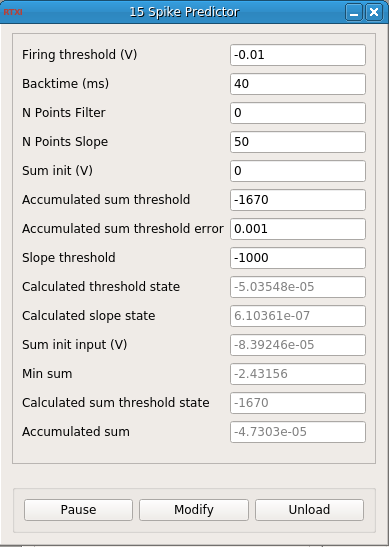

### Spike Predictor

**Requirements:** None  
**Limitations:** None  

<!--start-->

<b>Spike Predictor:</b> Module for spike prediction based on a threshold by voltage, area or slope.

<!--end-->

#### Input
1. input(0) - /*Module variables*/ Living neuron : Signal input to analize
2. input(1) - Integrate init input (V) : Voltage value to reset sum

#### Output
1. output(0) - Filtered signal : Filter
2. output(1) - Calculated threshold : Calculated threshold
3. output(2) - Calculated slope : Calculated slope
4. output(3) - Calculated sum threshold : Calculated Accumulated sum threshold
5. output(4) - Slope output : Slope value
6. output(5) - Sum output : Accumulated sum value as an output
7. output(6) - Crossed Sum State : Whether the sum has surpased the threshold
8. output(7) - Crossed Voltage State : Whether the voltage has surpased the threshold
9. output(8) - Crossed Slope State : Whether the sum has surpased the threshold

#### Parameters
1. Firing threshold (V) - Threshold to declare spike beggining
2. Backtime (ms) - Time before max that define Calculated threshold
3. N Points Filter - Number of points for the filter
4. N Points Slope - Number of points for the slope
5. Sum init (V) - Voltage value to reset accumulated sum
6. Accumulated sum threshold - Value of the accumulated sum that triggers x (if >=0 calculates threshold)
7. Accumulated sum threshold error - Allowed error for v-sum_reset (recommended 0.003)
8. Slope threshold - Value of the slope that triggers the state (if -1000 calculates threshold)

#### States
1. Calculated threshold state - Calculated threshold
2. Calculated slope state - Calculated slope
3. Sum init input (V) - Minimum voltage sum
4. Min sum - Minimum voltage sum
5. Calculated sum threshold state - Calculated threshold for sum
6. Accumulated sum - Accumulated voltage sum
